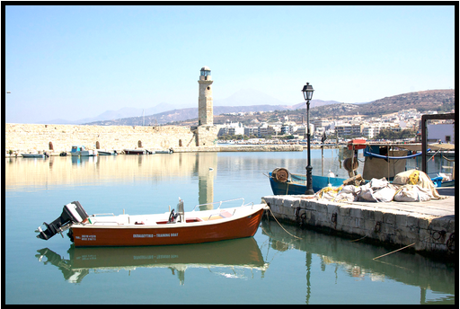
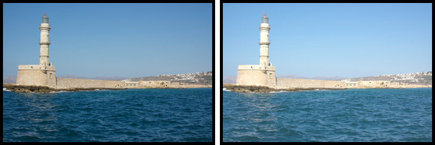
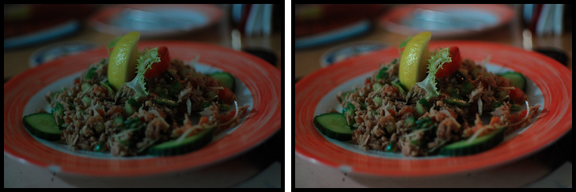
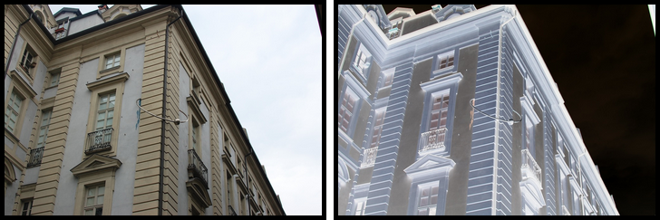
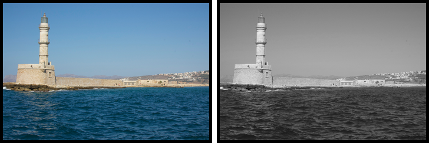
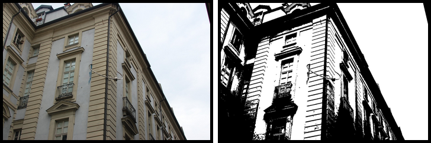

Vidi
====

Vidi.js is a JavaScript Library for Digital Image Processing.

## Point Operations
Point operations perform a mapping of the pixel values without changing the size, geometry, or local structure of the image. 
Each new pixel value depends exclusively on the previous value at the same position and is thus independent from any pixel value.

### Contrast
To increase the contrast of an image by a 40% factor:

```javascript
var img = document.getElementById('myimg'),
    vimg = new Vidi(img);
    
vimg.contrast(1.4).show();
```



### Brightness
To increase the brightness of an image by 40 points:

```javascript
var img = document.getElementById('myimg'),
    vimg = new Vidi(img);

vimg.brightness(40).show();
```


### Autocontrast
Automatic contrast adjustment (auto-contrast) modify the pixels such that the available range of values is fully covered.

```javascript
var img = document.getElementById('myimg'),
    vimg = new Vidi(img);

vimg.autoContrast().show();
```


### Invert
The invert function reverses the ordering of pixel values: 0 -> 255, 1 -> 254, 2 -> 253, ..., 255 -> 0

```javascript
var img = document.getElementById('myimg'),
    vimg = new Vidi(img);

vimg.invert().show();
```


### Conversion to Grayscale
The toGray function convert an sRGB color image to a grayscale one using the following weights for each color channel: R = 0.309, G = 0.609, B = 0.082

```javascript
var img = document.getElementById('myimg'),
    vimg = new Vidi(img);

vimg.toGray().show();
```


### Threshold
The threshold function separate the pixel values in two classes (black and white) depending upon the threshold value param.
In this example all the pixel with a luminance value greater than 120 are mapped to white, otherwise to black.

```javascript
var img = document.getElementById('myimg'),
    vimg = new Vidi(img);

vimg.threshold(120).show();
```

