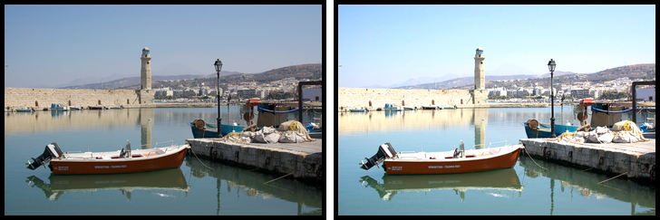

Vidi
====

Vidi.js is a JavaScript Library for Digital Image Processing.

## Point Operations
Point operations perform a mapping of the pixel values without changing the size, geometry, or local structure of the image. 
Each new pixel value depends exclusively on the previous value at the same position and is thus independent from any pixel value.

### Contrast
To increase the contrast of an image by a 40% factor:

```javascript
var img = document.getElementById('myimg'),
    vimg = new Vidi(img);
    
vimg.contrast(1.4).show();
```



### Brightness
To increase the brightness of an image by 40 points:

```javascript
var img = document.getElementById('myimg'),
        vimg = new Vidi(img);

vimg.brightness(40).show();
```
